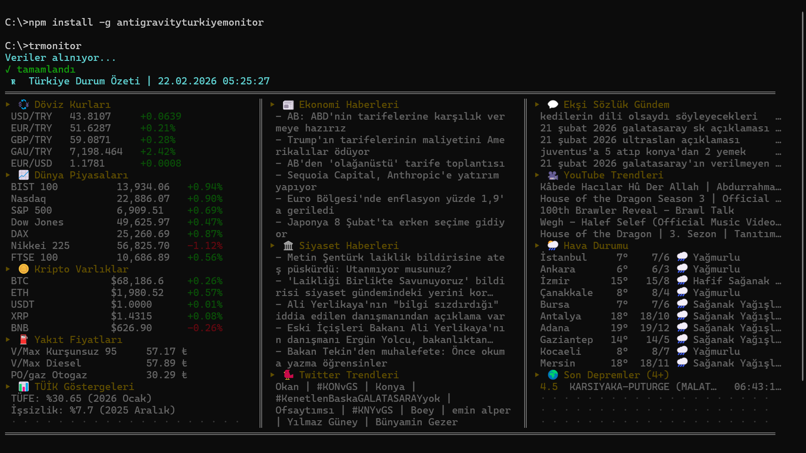

# AntigravityTurkiyeMonitor 🇹🇷

A powerful CLI tool to monitor Turkiye's agenda in real-time. Get economic data, news, social trends, earthquakes, and more — all from your terminal.



[](https://github.com/bariskisir/AntigravityTurkiyeMonitor)
[](https://www.npmjs.com/package/antigravityturkiyemonitor)


## Installation

```bash
npm install -g antigravityturkiyemonitor
```


## Usage

```bash
trmonitor
trmonitor --lang tr
trmonitor --lang en
```

| Option | Description | Default |
|--------|-------------|---------|
| `--lang` | Output language (`tr` or `en`) | Auto-detect from OS |
| `--log` | Show application logs | - |
| `--version` | Show version | - |
| `--help` | Show help | - |


## Modules

| # | Module | Source |
|---|--------|--------|
| 1 | 💱 Exchange Rates | investing.com |
| 2 | 📈 BIST 100 Stocks | investing.com |
| 3 | 🪙 Crypto Assets | investing.com |
| 4 | ⛽ Fuel Prices | petrolofisi |
| 5 | 📊 TUIK Indicators | tuik |
| 6 | 📰 Economic News | bloomberght.com |
| 7 | 🐦 Twitter Trends | getdaytrends.com |
| 8 | 🏛️ Politics News | sondakika.com |
| 9 | 💬 Ekşi Sözlük Agenda | eksisozluk.com |
| 10 | 🌍 Earthquakes (4+) | kandilli |
| 11 | ▶️ YouTube Trends | yttrendz.com |
| 12 | 🌦️ Weather | mgm.gov.tr |


## License

MIT
